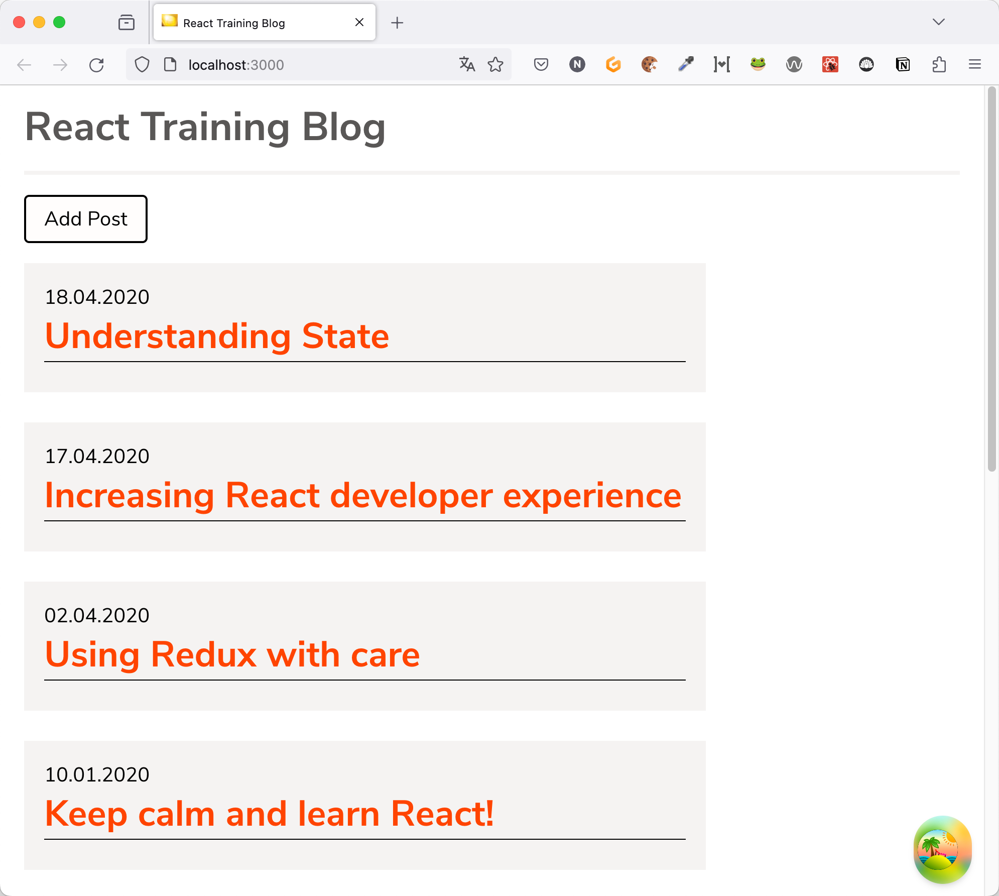
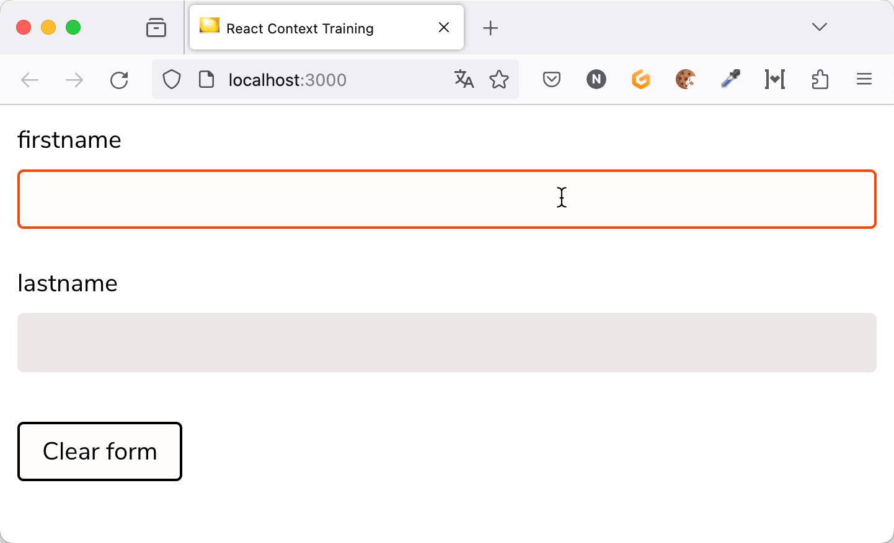

# Vorbereitungen React Aufbau Schulung

> Während des Workshops werden wir Übungen machen. Damit du daran teilnehmen kannst, ist es erforderlich, dass Du ein paar Dinge installierst (sofern noch nicht geschehen).
>
> **Aus diesem Grunde führe bitte diese Installationsanleitung bereits _vor_ dem Workshop aus.** So hast Du noch die Möglichkeit, Probleme zu beheben. Das gilt insbesondere, wenn es auf deinem Computer (Sicherheits-)Restriktionen gibt und Du keinen vollen Admin-Zugriff hast.

## Voraussetzungen

**Für dein Laptop/PC**

Auf deinem Laptop/PC muss installiert sein:

- Git (zum installieren des Workspaces)
- [NodeJS](https://nodejs.org/en/download/) LTS version, aktuell 20.x oder 18.x. **Ältere Node-Versionen funktionieren unter Umständen nicht!**
- Browser
- Eine IDE oder ein Texteditor. Wenn Du bereits einen "Lieblingseditor" verwendest, benutze diesen während des Trainings, damit Du nicht auch noch ein neues Tool lernen musst. Ansonsten funktionieren folgende Tools zum Beispiel:
  - [Visual Studio Code](https://code.visualstudio.com/)
  - [Webstorm](https://www.jetbrains.com/webstorm/download/) (Evaluationsversion reicht)
  - [IntelliJ IDEA](https://www.jetbrains.com/idea/download/) (Ultimate Edition, Evaluationsversion reicht aber)

**Optional: Browser Erweiterungen für React**

- Für das Arbeiten mit React empfehle ich, die [React Developer Tools](https://github.com/facebook/react/tree/master/packages/react-devtools) zu installieren. Es gibt sie für [Chrome/Edge](https://www.google.com/url?sa=t&rct=j&q=&esrc=s&source=web&cd=1&cad=rja&uact=8&ved=2ahUKEwjE14vhq-rmAhVGblAKHbgOC1sQFjAAegQICRAK&url=https%3A%2F%2Fchrome.google.com%2Fwebstore%2Fdetail%2Freact-developer-tools%2Ffmkadmapgofadopljbjfkapdkoienihi&usg=AOvVaw3YJDg7kXgeeChgKN88s0Sx) und [Firefox](https://addons.mozilla.org/de/firefox/addon/react-devtools/).
- Für den Workshop sind die Developer Tools aber nicht notwendig.

**Während des Trainings**

- Da wir vor und während des Trainings ggf. noch Aktualisierungen installieren müssen, **bitte sicherstellen, dass auch _während_ der Schulung auf deinem Computer der Internet-Zugang funktioniert**.
  - Bitte überprüfe, dass keine Proxy, VPN- oder Firewall- oder andere Einstellungen den Zugang zu Git und npm verhindern. Das gilt insbesondere, wenn Du keine Admin-Rechte auf dem Computer hast.
  - Bitte stelle sicher, dass das Installieren von npm-Paketen und das Klonen von Git-Repositories **auch während der Schulung** funktioniert
  - Informationen zum Einrichten eines Proxies für npm findest Du bei Bedarf [zum Beispiel hier](http://wil.boayue.com/blog/2013/06/14/using-npm-behind-a-proxy/).

# Installation und Vorbereitung des Workspaces für die Schulung

Damit wir sicher sind, dass während des Workshops alles funktioniert, möchte ich dich bitten, im Vorweg schon einmal die folgenden Schritte durchzuführen, auch wenn es während des Workshops möglicherweise noch ein Update gibt (deswegen bitte sicherstellen, dass git und npm auch _während_ des Workshops funktionieren).

## Schritt 1: Repository klonen und Pakete installieren

1. Das Repository klonen:

```
git clone https://github.com/nilshartmann/react18-training
```

2. Die benötigten npm-Pakete installieren:

```

cd react18-training/blog-example/backend-rest
npm install

cd react18-training/context-example/context-workspace
npm install
npm run check

cd react18-training/advanced/workspace
npm install
npm run check
```

## Schritt 2: Testen, ob REST-Backend funktioniert

1. Im Verzeichnis **blog-example/backend-rest** des Repositories das Backend starten:

```
cd blog-example/backend-rest
npm start
```

Achtung! Das Backend läuft auf **Port 7000**, d.h. dieser Port muss verfügbar sein.

2. Backend testen

- Im Browser (oder per curl, wget oder httpie) aufrufen: http://localhost:7000/posts
- Dort sollte JSON Code zurückkommen

## Schritt 3: Testen, ob das Blog-Example-Frontend funktioniert

1. Frontend (Beispiel-Anwendung) starten

Dazu in das Verzeichnis `react18-training/advanced/workspace` wechseln und `npm start` ausführen:

```
cd react18-training/advanced/workspace

npm start
```

Achtung! Das Frontend läuft auf **Port 3000**, d.h. dieser Port muss verfügbar sein.

2. Wenn das Frontend gestartet ist, zum testen einmal die Anwendung im Browser aufrufen: [http://localhost:3000](http://localhost:3000). Dort sollte eine Liste von Blog-Posts erscheinen.



## Schritt 4: Testen, ob das Context-Example-Frontend funktioniert

Achtung! Auch diese Anwendung läuft auf **Port 3000**, d.h. dieser Port muss verfügbar sein. Bitte beende vorher das "Blog Example"-Frontend.

In das Verzeichnis `react18-training/advanced/workspace` wechseln und `npm start` ausführen:

```
cd react18-training/context-example/context-workspace

npm start
```



**Das ist alles 😊**

Bei Fragen oder Problemen melde dich gerne bei mir.
